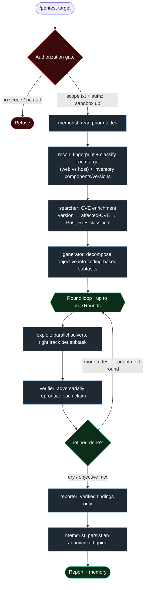

# Umbra

**Umbra** is a Claude Code **plugin** for autonomous, authorization-gated penetration
testing. A recon-first orchestration engine fingerprints and classifies each target,
fans a roster of specialist agents out across two execution tracks, adversarially
verifies every finding, and writes a report — all behind hard guardrails (an explicit
scope allowlist and a disposable, egress-locked sandbox).

> ⚠️ **Authorized testing only.** Umbra runs real offensive tooling. Only point it at
> systems you own or have **explicit written authorization** to test. You are responsible
> for staying within that authorization and the law.

## Install

Umbra installs as a Claude Code plugin from this repo's marketplace. **In Claude Code:**

```text
/plugin marketplace add mushhzz/umbra
/plugin install umbra@umbra
```

…or from your shell (non-interactive):

```bash
claude plugin marketplace add mushhzz/umbra
claude plugin install umbra@umbra
```

`umbra@umbra` is `<plugin>@<marketplace>` — both are named `umbra` here. To update later:
`/plugin marketplace update umbra`.

### Prerequisites

- **Docker** — the network/host track runs entirely inside a disposable Kali container
  (`scripts/sandbox.sh`). Docker must be installed and running.
- **[`agent-browser`](https://www.npmjs.com/package/agent-browser) CLI** (optional) — only
  needed for the web track (DOM/HTTP testing). The network track does not require it.

The sandbox script ships with the plugin and is referenced via `${CLAUDE_PLUGIN_ROOT}`, so
it works from wherever Claude Code installs the plugin — no manual path setup. Umbra installs
**no global hooks**: it never intercepts your shell outside an engagement.

## Two execution tracks

Umbra tests **any** target, not just web apps. Recon classifies each in-scope target and
the pentester picks the track per objective:

- **Network / host track — Kali Docker sandbox.** All host/service/network tooling
  (`nmap`, service enumeration, `sqlmap`, `hydra`, `nikto`, `gobuster`, `netcat`,
  `searchsploit`, Metasploit if installed) runs *inside* a disposable Kali container via
  `scripts/sandbox.sh exec` — never on your host. The container runs on its own bridge
  with **egress firewalled to the in-scope allowlist only**.
- **Web track — `agent-browser` CLI.** Stateful, per-`--session` browser automation for
  web/DOM/HTTP testing: in-page `fetch()` for same-origin authenticated API abuse, and
  `open`/`snapshot`/`click`/`fill` for client-side behavior. `agent-browser` is web-only.

## The engagement flow (`workflows/engagement.js`)



The `exploit → verify → refine` core is an adaptive loop: each round's verified findings and
dead ends steer the refiner, which rewrites the next round's subtasks and stops when the work
goes dry. See **[docs/ARCHITECTURE.md](docs/ARCHITECTURE.md)** for the full set of diagrams
(two tracks, the egress-locked sandbox, agent roster, CVE enrichment, per-round sequence,
and the structured-data handoff between stages).

Workflow agents run as `general-purpose` with their specialist role carried inline in the
prompt (the workflow engine can't spawn plugin agent types); the durable `agents/*.md`
definitions are used via the Task tool and after `/reload-plugins`.

## Agent roster (`agents/*.md`)

- **Workers:** `pentester`, `coder`, `installer`, `searcher`
- **Planners:** `generator` (decompose), `refiner` (adapt)
- **Memory / knowledge:** `memorist` (recall), `summarizer` (compress)
- **Supervision:** `verifier` (adversarial finding confirmation), `reflector` (tool-call
  barrier enforcer), `adviser` (mentor), `enricher` (context for the adviser)
- **Reporting / control:** `reporter`, `orchestrator`, `assistant` (human steering)

The `orchestrator` and `reporter` roles are also surfaced as skills
(`pentest-orchestration`, `pentest-reporting`) for driving an engagement by hand.

## CVE enrichment

Recon inventories every fingerprinted component + version (flagging EOL/outdated ones). A
`searcher` stage resolves affected CVEs and public PoCs — **CVE web lookups run host-side**
(the sandbox egress is target-locked), `searchsploit` runs inside the sandbox — and checks
whether the *detected* version is actually affected. Each CVE is classified `roeSafe`: only
non-destructive proofs are attempted; crash/DoS/memory-corruption classes stay research-only.

## Guardrails

Scope is enforced **mechanically inside the sandbox** and **by authorization** everywhere:

1. **Egress-locked sandbox** (`scripts/sandbox.sh`) — the network/host track runs entirely
   inside a disposable Kali container whose outbound firewall is seeded from `.umbra/scope.txt`.
   All host/service tooling (`nmap`, `sqlmap`, `hydra`, …) runs there, so even a mistaken or
   out-of-scope command physically cannot reach a host outside the allowlist — the packet is
   dropped at the container's egress. This is the load-bearing control.
2. **Scope allowlist + authorization** (`.umbra/scope.txt`) — you establish written
   authorization and the allowlist before any engagement; `/pentest` gates on this first.

> Umbra deliberately installs **no global Claude Code hook** — nothing intercepts your shell
> outside an engagement. The consequence: the **web track** (`agent-browser`, which runs
> host-side, *not* in the container) has no packet-level lock, so on that track staying in
> scope is enforced by the agent honoring the allowlist, not by a firewall. Keep the allowlist
> tight and review web-track activity accordingly.

These controls do not replace authorization: **only test systems you are authorized to test**,
and establish written authorization + the scope allowlist first.

## Usage

Once the plugin is installed (see [Install](#install)) and Docker is running, start an
engagement from Claude Code:

```text
/pentest app.example.com
```

The `/pentest` command **gates on authorization first**: it confirms you're authorized,
writes your allowlist to `.umbra/scope.txt` (one host/CIDR per line, in your project
directory), and brings the egress-locked Kali sandbox up — then runs the recon → exploit →
verify → refine → report flow. `.umbra/` (scope, reports, memory) is created in your working
directory and is per-project runtime state — keep it out of version control.

If you'd rather set scope by hand before running:

```bash
mkdir -p .umbra
printf 'app.example.com\n' > .umbra/scope.txt   # one authorized host/CIDR per line
```

You can also drive an engagement manually with the `pentest-orchestration` and
`pentest-reporting` skills instead of the workflow.

## Enhancements (v0.5.0)

Three optional, self-activating modules raise finding precision and coverage. Default behaviour is
unchanged unless you opt in. Burp is optional throughout.

- **Execution-based verification (always on).** The verifier now demands a concrete execution
  artifact before trusting a finding: XSS must actually execute JS, blind SSRF/XXE/RCE/SQLi need an
  out-of-band hit, SQLi needs a boolean/time differential, IDOR needs a two-identity diff.
  Plausible-but-unproven findings are dropped.
- **Out-of-band detection** (`oob`) — `scripts/oob.sh`. Detects blind SSRF/XXE/RCE/blind-XSS.
  - `oob: "burp"` — use **Burp Collaborator** via the [Burp MCP server](https://github.com/PortSwigger/mcp-server)
    (`mcp__burp__generate_collaborator_payload` / `get_collaborator_interactions`). Requires Burp Pro.
  - `oob: "interactsh"` — self-hosted/cloud interactsh: set `UMBRA_OOB_SERVER` (+ optional
    `UMBRA_OOB_TOKEN`). The free public OAST servers are deprecated, so a server is required.
  - Omitted → OOB stays dormant.
- **White-box source review** (`source: { repo, ref }`) — `scripts/whitebox.sh`. Shallow-clones the
  target's source read-only and adds variant analysis (find a bug, then sweep the tree for siblings).
- **Burp proxy** (`proxy: "http://127.0.0.1:8080"`). Routes all agent-browser web-track traffic
  through Burp (adds `--proxy … --ignore-https-errors`) for history/Repeater/Collaborator visibility.

Example (workflow args):

```json
{ "target": "app.example.com", "scope": ["app.example.com"],
  "oob": "burp", "proxy": "http://127.0.0.1:8080",
  "source": { "repo": "https://github.com/org/app.git", "ref": "main" } }
```

## Live dashboard (`dashboard/`)

A local, read-only, zero-dependency dashboard streams a running engagement to the browser: agent
progress by phase, findings as they verify (CLAIMED → CONFIRMED/REJECTED), artifacts from `.umbra/`,
and live Burp activity (proxy history filtered to scope, Collaborator hits, scanner issues).

```bash
node dashboard/server.js   # then open http://127.0.0.1:7878
```

Auto-discovers the newest run and follows it. Binds `127.0.0.1` only; never touches the target.

## Bug bounty mode

`/pentest-bounty` runs an engagement under bug-bounty **Rules of Engagement** — for testing a
program you are **enrolled in**. It tunes Umbra down to what bug-bounty programs actually allow:

- **Attribution** — a configurable header (e.g. `X-Bug-Bounty: <handle>`) on every request.
- **Banned tooling** — brute-force (`hydra`/`medusa`), high-volume scanners (`masscan`,
  `nmap -T5`), aggressive `sqlmap`, and anything DoS/stress are off by default.
- **Rate discipline + capped concurrency** — the parallel solver fan-out is chunked so it can't
  exceed the program's rate limit.
- **Strict scope + exclusions** — only the assets you list; out-of-scope redirects are refused.

Set it up (all under your per-project `.umbra/`, which is gitignored):

```bash
cp examples/rules.md.example    .umbra/rules.md      # paste the program's full policy
cp examples/bounty.env.example  .umbra/bounty.env    # handle, header, rate, exclusions
printf 'app.example.com\n' >   .umbra/scope.txt      # ONLY explicitly in-scope hosts
# in Claude Code:
/pentest-bounty app.example.com
```

**HackerOne shortcut.** Instead of hand-copying scope, auto-pull it from the program's
structured scopes: put your API token in a gitignored `.umbra/h1.env` (see
`examples/h1.env.example`), then `scripts/h1-scope.sh <program-handle>` writes `.umbra/scope.txt`
(wildcards commented out to enumerate) and a `.umbra/rules.md` draft. The API can't tell you
whether automation is permitted — you still read the policy and confirm before running.

> **Authorization is yours to establish, and it is narrow.** A bug bounty authorizes *only* what
> the program's policy says, *only* while you're enrolled. **Many programs prohibit automated
> scanning entirely** — if yours does, Umbra must not be pointed at it. There is no public
> program that authorizes a fully autonomous exploitation engine off the shelf; treat the policy
> as the hard boundary. Note too that the **web track has no packet-level scope lock** (see
> [Guardrails](#guardrails)), so scope discipline there rests on the agent honoring the allowlist.

**Validate the profile first** against a target you own, or an explicitly-authorized host:
`scanme.nmap.org` authorizes **nmap port-scanning only** (no exploits/DoS, ≤ ~a dozen scans/day) —
enough to confirm attribution and rate-limiting behave before you touch a live program asset.

## Environment knobs (sandbox)

`UMBRA_SANDBOX_BASE` (base image), `UMBRA_SANDBOX_HEAVY=1` (add Metasploit),
`UMBRA_SANDBOX_EGRESS=off` (disable the egress lock), `UMBRA_SANDBOX_CAPS=NET_RAW`
(for `nmap -sS`), `UMBRA_SANDBOX_MEMORY`, `UMBRA_SANDBOX_PIDS`.
