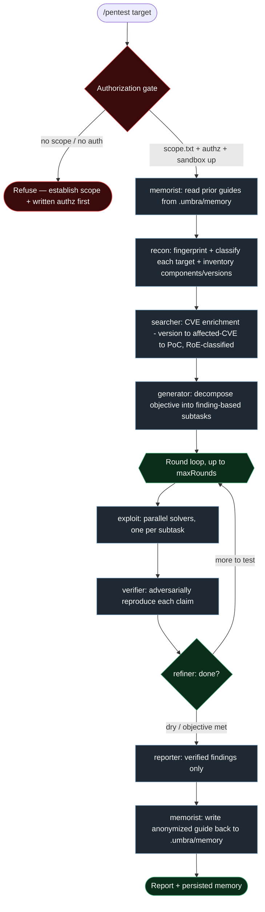
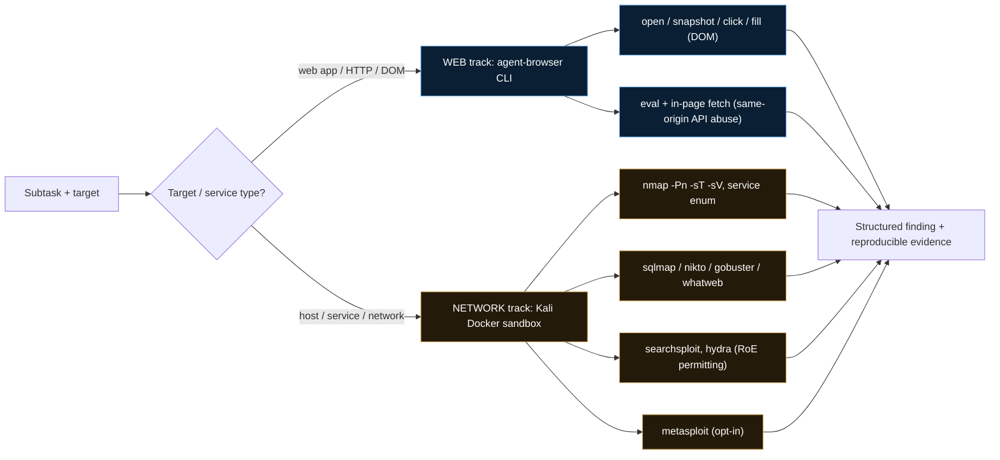
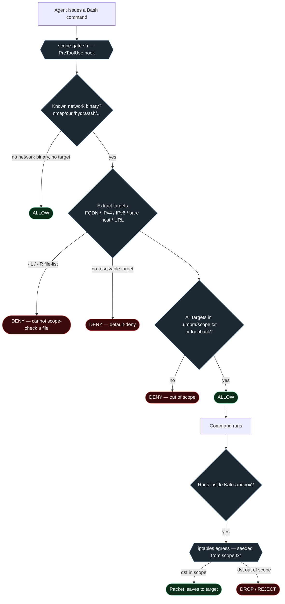
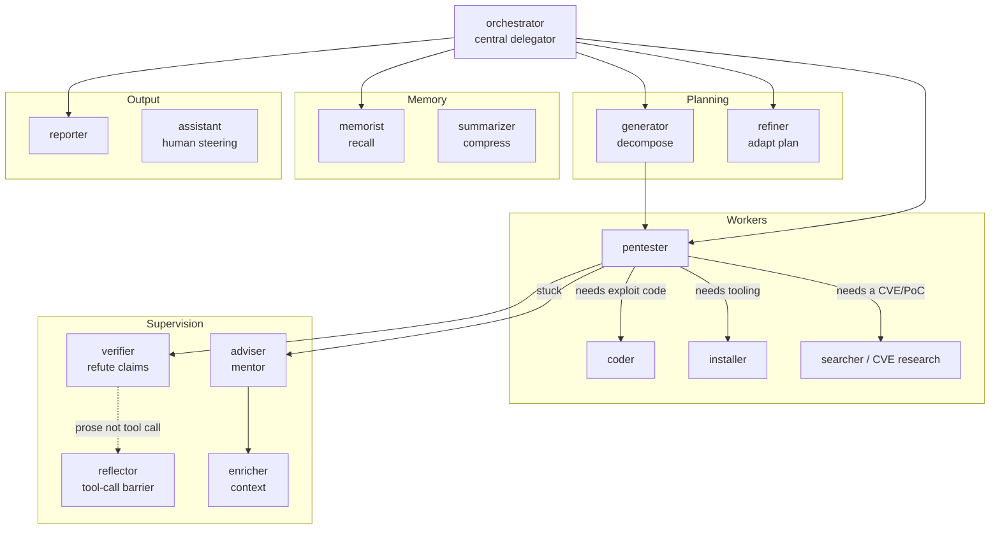
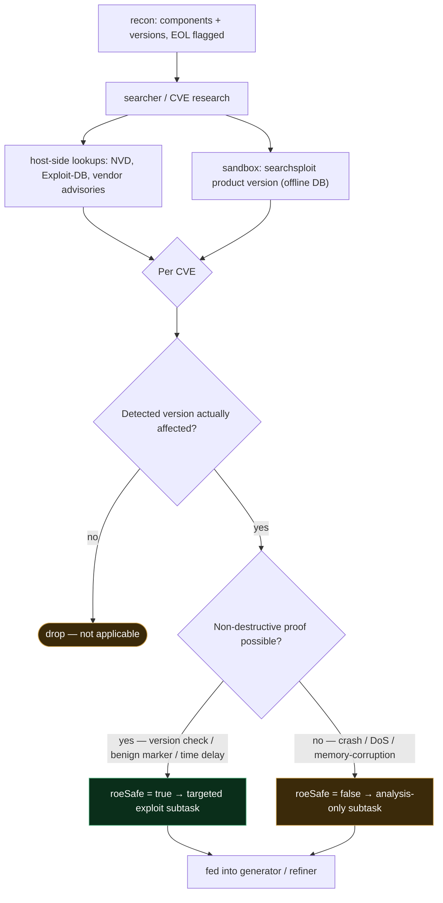
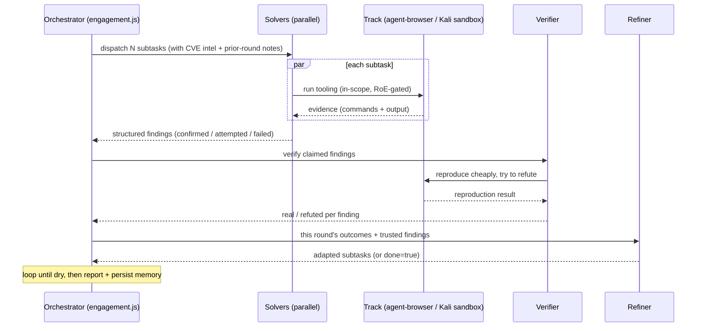

# Umbra — Architecture

Detailed diagrams of how Umbra runs an engagement. Umbra is an autonomous, multi-agent
penetration-testing plugin for Claude Code: a recon-first orchestration engine that fans
specialist agents across two execution tracks behind hard guardrails.

---

## 1. End-to-end engagement flow

The `workflows/engagement.js` engine. Everything is preceded by a hard authorization gate;
the core is an adaptive **exploit → verify → refine** loop that runs until it goes dry.

Key properties:

- **Nothing is trusted until reproduced.** Every claimed finding is re-run by an adversarial
  verifier that defaults to "not real" and tries to refute it; unproven claims are discarded.
- **Findings are captured and fed forward.** Each round's results steer the refiner, which
  adapts the next round (add follow-ups, drop dead ends, pivot after repeated failure).
- **Memory closes the loop.** Prior guides are read at the start; an anonymized guide is
  written at the end.

---

## 2. Two execution tracks

Recon classifies each target; the pentester picks the track per subtask. `agent-browser`
is web-only; everything host/network goes through the Kali sandbox.

---

## 3. Guardrails — defense in depth

Two **independent** controls enforce scope: a PreToolUse hook blocks the *command*, and the
sandbox's egress firewall blocks the *packet*. Either alone would suffice; together a mistake
has to defeat both.

The sandbox itself is a disposable Kali container: own bridge network, `--cap-drop=ALL`,
`--security-opt no-new-privileges`, `--pids-limit`, `--memory`, and egress default-deny.

---

## 4. Agent roster

15 specialist roles. In the `engagement.js` workflow they run as `general-purpose` agents
with the role carried inline (the workflow engine can't spawn plugin agent types); as durable
`agents/*.md` they're available via the Task tool and after `/reload-plugins`.

---

## 5. CVE enrichment

Recon's component/version inventory drives a dedicated research stage. Web CVE lookups run
host-side (the sandbox egress is target-locked); `searchsploit` runs inside the sandbox.

**Never run untrusted PoC binaries blindly** — the searcher studies the technique so the
pentester reconstructs a minimal, safe test. EOL/outdated components are prioritized.

---

## 6. One round — sequence

---

## 7. Structured-data handoff between stages

Stages don't pass prose — each agent returns a **schema-validated object** (`agent(..., { schema })`
forces the model to a structured tool call and re-prompts on mismatch), so every handoff is typed
and machine-checkable. This is what makes the loop deterministic to orchestrate. Schemas live at the
top of `workflows/engagement.js`.

```mermaid
flowchart LR
    MEM["memoryBrief<br/><i>(prose)</i>"] --> RECON
    RECON["recon<br/>RECON_SCHEMA"] -->|"targets[].track<br/>components[] + eol"| CVE["searcher<br/>CVE_SCHEMA"]
    RECON -->|"surfaceNotes<br/>appIdentity"| GEN
    CVE -->|"cves[]: applicabilityConfirmed<br/>+ roeSafe"| GEN["generator<br/>GEN_SCHEMA"]

    GEN -->|"subtasks[]: track, target, goal"| SOLVE["solvers ×N<br/>SOLVE_SCHEMA"]
    SOLVE -->|"findings[]: status<br/>confirmed / attempted / failed<br/>+ evidence"| VER["verifier<br/>VERIFY_SCHEMA"]
    VER -->|"verified[]: real = true/false"| TRUST[(trustedFindings)]
    VER -->|"verdicts + notes"| REFINE["refiner<br/>REFINE_SCHEMA"]

    REFINE -->|"done = false<br/>subtasks[] for next round"| SOLVE
    REFINE -->|"done = true"| REPORT["reporter<br/><i>(prose report)</i>"]
    TRUST --> REPORT
    REPORT --> WRITE["memory writer<br/>anonymized guide.md"]

    classDef schema fill:#1f2933,stroke:#7aa2c2,color:#fff;
    classDef prose fill:#241a0a,stroke:#d0a24a,color:#fff;
    classDef store fill:#0a2e1a,stroke:#4caf7d,color:#fff;
    class RECON,CVE,GEN,SOLVE,VER,REFINE schema;
    class MEM,REPORT,WRITE prose;
    class TRUST store;
```

Only two boundaries are deliberately free-form: the **memory brief** in (read prior guides) and the
**final report / persisted guide** out. Everything the loop reasons over in between is a validated
object, and only `verified[].real === true` findings ever reach `trustedFindings` — the single source
the report is written from.
